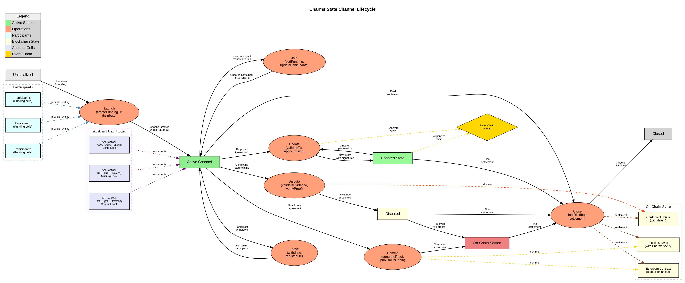

# State Channel Diagrams

This document provides visual representations of the Charms State Channel lifecycle and operations. The diagrams illustrate how state channels are created, updated, and settled on different blockchains using the abstract cell model.

## State Channel Lifecycle

We've created two versions of the state channel lifecycle diagram to illustrate the flow and operations:

### Version 1: Basic Flow

This diagram shows:
- The basic state transitions from channel creation to settlement
- The relationship between participants, operations, and blockchain state
- The hash-linked event chain structure underlying the state updates
- How abstract cells map to different blockchains

### Version 2: Enhanced Directional Flow

The second version enhances the clarity with:
- A more explicit left-to-right flow for all operations
- Clearer spacing between nodes to make edge labels more legible
- More consistent grouping of related components
- Better visual separation between main and auxiliary operations

## Key Components

### States
- **Uninitialized**: Before channel creation
- **Active Channel**: Open and operational channel
- **Updated State**: After state transitions
- **Disputed**: Conflicting state claims that need resolution
- **On-Chain Settled**: Channel state committed to blockchain
- **Closed**: Channel terminated with final distribution

### Operations
- **Launch**: Create the channel with initial funding and distribute to participants
- **Join**: Add a new participant to an existing channel
- **Update**: Apply a state transition with validation and signatures
- **Leave**: Participant withdraws from channel with their share
- **Commit**: Publish latest agreed state to blockchain
- **Dispute**: Resolve conflicting claims with evidence and proofs
- **Close**: Final settlement and distribution of assets

### Blockchain Integration
The diagrams show how channels interact with different blockchains:
- **Bitcoin**: Using UTXOs with Charms spells
- **Ethereum**: Using contract storage and function calls
- **Cardano**: Using eUTXOs with datum

### Event Chain Model
The hash-linked event chain shows how states progress through a sequence of transactions, each with its own proof and signatures, forming a cryptographically verifiable history of state transitions.

## Implementation Considerations

When implementing this state channel framework, consider:

1. **Cross-Chain Compatibility**: Abstract cells must correctly map to and from native blockchain structures
2. **Proof Generation**: zkVM proofs must be efficient to generate and verify
3. **Security**: Dispute resolution must handle all possible attack vectors
4. **User Experience**: Channel operations should be as simple as possible for developers and users

These diagrams represent the conceptual model of our state channel design. The actual implementation will require detailed protocol specifications and a comprehensive security model.
