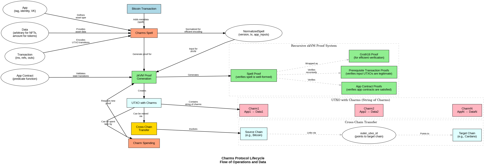

# Charms Protocol Lifecycle

This document describes the operational lifecycle of the Charms protocol, illustrating how Charms enables programmable assets on Bitcoin and other blockchains through client-side validation and recursive zero-knowledge proofs.

## Lifecycle Overview



The Charms protocol lifecycle consists of several key stages:

1. **Bitcoin Transaction Creation** - The foundation of all Charms operations
2. **Charm Spell Addition** - Metadata that describes asset creation and manipulation
3. **zkVM Proof Generation** - Recursive verification of spell and app contracts
4. **UTXO with Charms Creation** - Asset-containing outputs in the UTXO model
5. **Charm Spending** - Using assets in subsequent transactions
6. **Cross-Chain Transfer** - Moving assets between blockchains

## Core Components

### 1. App Definition

An `App` is defined by a triple of:
- **tag**: Single character representing app type ('n' for NFTs, 't' for fungible tokens)
- **identity**: 32-byte array uniquely identifying the asset
- **VK**: 32-byte verification key hash for the app contract

This structure defines the type of asset and its behavior.

### 2. Data

The `Data` component represents:
- For fungible tokens (tag='t'): A simple numeric amount (u64)
- For NFTs (tag='n'): Arbitrary data associated with the NFT
- For other apps: Application-specific state data

### 3. Transaction

A `Transaction` in Charms consists of:
- **ins**: Input UTXOs being spent
- **refs**: Reference UTXOs for reading (not spending)
- **outs**: Output UTXOs being created

This structure creates a DAG (Directed Acyclic Graph) of spent and created UTXOs.

### 4. App Contract

An `App Contract` is a predicate function with signature:
```rust
fn app_contract(app: &App, tx: &Transaction, x: &Data, w: &Data) -> bool
```

This function validates state transitions for the asset, ensuring that only valid operations are performed.

### 5. Normalized Spell

The `NormalizedSpell` is an efficient encoding of spell data:
- **version**: Protocol version
- **tx**: Transaction in normalized form
- **app_public_inputs**: Data for app contract validation

## Lifecycle Stages

### 1. Bitcoin Transaction Creation

The lifecycle begins with a standard Bitcoin transaction. This transaction will serve as the carrier for Charms data and provide the underlying security guarantees against double-spending.

### 2. Charm Spell Addition

A Charm spell is added to the Bitcoin transaction as metadata within a Taproot witness script. The spell uses an envelope structure with `OP_FALSE OP_IF ... OP_ENDIF` to include:
- The spell identifier string "spell"
- CBOR-encoded normalized spell data
- Groth16 proof data

### 3. zkVM Proof Generation

For the spell to be valid, a recursive zero-knowledge proof must be generated that attests to:
- The spell is well-formed
- All app contracts in the transaction are satisfied
- All prerequisite transactions (those creating UTXOs being spent) had valid spells

This uses a RISC-V based zkVM to execute verification logic and generate Groth16 proofs.

### 4. UTXO with Charms Creation

When the transaction is confirmed, it creates UTXOs that contain "strings of charms" - collections of (App → Data) mappings. Each UTXO can contain multiple charms, enabling composition of different assets and app states.

### 5. Charm Spending

To spend a charm, a new transaction must be created that:
- Includes the UTXO containing the charm as an input
- Creates new output UTXOs with updated charm data
- Contains a spell with valid proof

This allows for transferring, transforming, or consuming charms according to their app contract rules.

### 6. Cross-Chain Transfer

Charms can be transferred across blockchains through a mechanism that:
1. Creates UTXOs on the target chain
2. Creates a charm output on the source chain with an `outer_utxo_id` pointing to the target chain UTXO
3. Uses proofs to validate the transfer on both chains

This enables seamless asset movement without traditional bridges or trusted parties.

## Proof System Details

The proof system is central to Charms and consists of:

### Spell Proof

Verifies the spell is correctly formed and consistent with the transaction.

### App Contract Proofs

Verifies that all app contracts are satisfied for the assets involved in the transaction.

### Prerequisite Transaction Proofs

Recursively verifies that all input UTXOs contain legitimate charms by checking their creation transactions' spell proofs.

### Groth16 Proof

Wraps the verification in a succinct zero-knowledge proof that can be efficiently verified by clients without traversing transaction history.

## Strings of Charms

A key innovation in Charms is the ability to have multiple charms in a single UTXO:

- **Charm1**: (App1 → Data1)
- **Charm2**: (App2 → Data2)
- **CharmN**: (AppN → DataN)

This enables composition of different assets and application states in a single UTXO, allowing for complex interactions like limit orders, NFTs with royalty policies, and other composable applications.

## Conclusion

The Charms protocol lifecycle demonstrates how Bitcoin's UTXO model can be extended with programmable assets through client-side validation and recursive zero-knowledge proofs. This approach maintains Bitcoin's security guarantees while enabling rich asset behaviors without requiring changes to the underlying blockchain.

The design also includes native cross-chain functionality, allowing assets to move between blockchains without trusted bridges. This makes Charms uniquely positioned as a portable asset protocol that can operate across the broader blockchain ecosystem.
