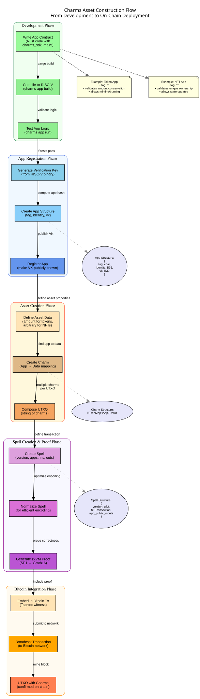
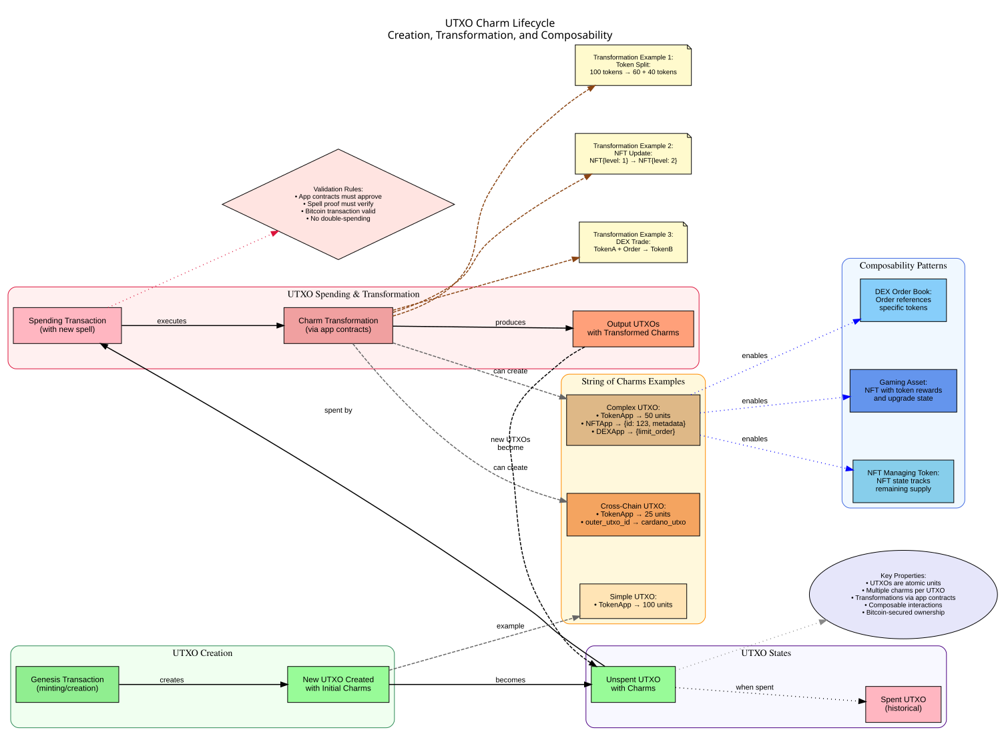

# Introduction to Charms

## What are Charms?

Charms is a protocol for programmable tokens and NFTs on top of Bitcoin. It extends Bitcoin's functionality by allowing developers to create and execute complex programs (called "apps") that can be verified using zero-knowledge proofs.

As described in the project's README:

> _Charms_ are bundles of tokens, NFTs and arbitrary app state, enchanting Bitcoin UTXOs, that can be used to build **apps** directly on Bitcoin.
>
> For example: Charms NFTs have state, so it's easy to create a token managed by an NFT: the token's remaining unminted supply is stored in the NFT state, and you can only mint the token when updating the NFT state accordingly (in the same transaction).
>
> Charms are created using _spells_ — special messages added to Bitcoin transactions, manifesting creation and **transformation** of charms.

## Key Concepts

### 1. Charms

Charms are the fundamental units in the protocol. They represent tokens, NFTs, or arbitrary application state that are attached to Bitcoin UTXOs (Unspent Transaction Outputs). Charms can be:

- **Tokens**: Fungible assets with a quantity (similar to ERC-20 tokens on Ethereum)
- **NFTs**: Non-fungible tokens with unique properties and state
- **App State**: Arbitrary application state that can be used to build complex applications

### 2. Spells

Spells are special messages embedded in Bitcoin transactions that create or transform Charms. A spell:

- Defines how Charms are created, transferred, or modified
- Contains a zero-knowledge proof that verifies the correctness of the transformation
- Is embedded in Bitcoin transactions using Tapscript

### 3. Apps

Apps are programs that define the rules for creating and transforming Charms. They are:

- Written in Rust (or any language that compiles to RISC-V)
- Executed in a zero-knowledge virtual machine (SP1 zkVM)
- Verified using Groth16 zero-knowledge proofs

## How Charms Work

The Charms protocol operates through a series of steps:

1. **App Development**: Developers create apps that define the rules for their tokens, NFTs, or other applications.

2. **Compilation**: Apps are compiled to RISC-V binaries that can be executed in the SP1 zkVM.

3. **Spell Creation**: Users create spells that reference these apps and define specific transformations of Charms.

4. **Proof Generation**: The system generates zero-knowledge proofs that verify the correctness of the spell's execution.

5. **Bitcoin Integration**: The spell and its proof are embedded in a Bitcoin transaction using Tapscript.

6. **Verification**: Other participants can verify the correctness of the spell by checking the zero-knowledge proof.

*Figure 1: Complete flow from app development to on-chain deployment*

For a detailed view of how developers build and deploy Charms apps, see the [App Development Sequence](diagrams/img/app-development-sequence.svg).

## UTXO and Charm Lifecycle

One of the key innovations of Charms is the ability to attach multiple programmable assets to a single Bitcoin UTXO, creating what we call a "string of charms." This enables powerful composability patterns where different types of assets can interact within the same transaction.

*Figure 2: How UTXOs with charms are created, transformed, and spent*

## Cross-Chain Capabilities

Charms supports cross-chain transfers through the Charms Cross-Chain Transfer (C3T) protocol, enabling assets to move between Bitcoin and other UTXO-based blockchains while retaining their programmable properties.

*Figure 3: C3T protocol for moving charms between blockchains*

To see this in action, check out our [Cross-Chain Journey Example](diagrams/img/cross-chain-journey-sequence.svg) showing assets moving from Bitcoin to Cardano and back, or the [Multi-User Trade Example](diagrams/img/multi-user-trade-sequence.svg) demonstrating atomic cross-chain exchanges.

## Benefits of Charms

- **Programmability on Bitcoin**: Brings complex programmability to Bitcoin without requiring changes to the Bitcoin protocol.
- **Composability**: Charms can be composed together to create complex applications within single UTXOs.
- **Cross-Chain Portability**: Move assets between compatible blockchains while preserving their programmable properties.
- **Privacy**: Zero-knowledge proofs allow for private computation while still ensuring correctness.
- **Security**: Leverages Bitcoin's security model while extending its functionality.

## Use Cases

- **Fungible Tokens**: Create and manage fungible tokens on Bitcoin with full programmability.
- **NFTs with State**: Create NFTs that have mutable state and complex behavior, going beyond simple ownership.
- **DeFi Applications**: Build decentralized finance applications directly on Bitcoin.
- **Gaming Assets**: Create and manage in-game assets with verifiable properties and cross-chain compatibility.
- **Cross-Chain DEXes**: Enable trustless trading between assets on different blockchains.
- **Identity and Reputation Systems**: Build identity and reputation systems with privacy-preserving properties.

In the next document, we'll explore the architecture of Charms in more detail.
