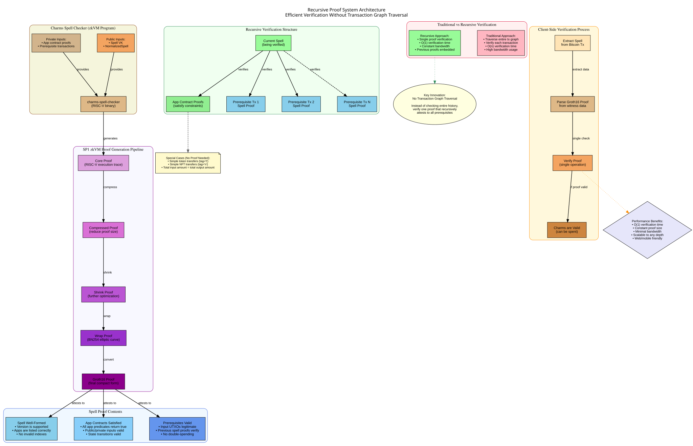
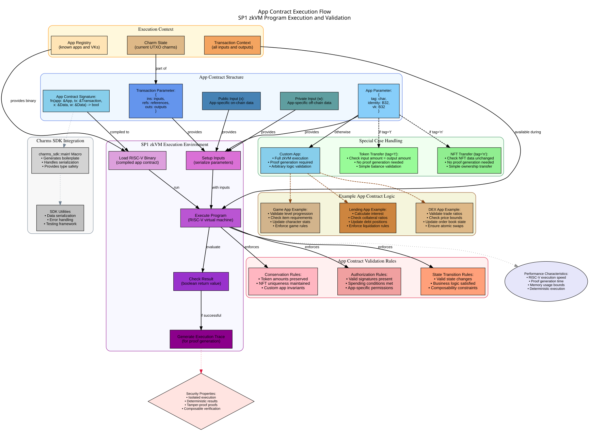
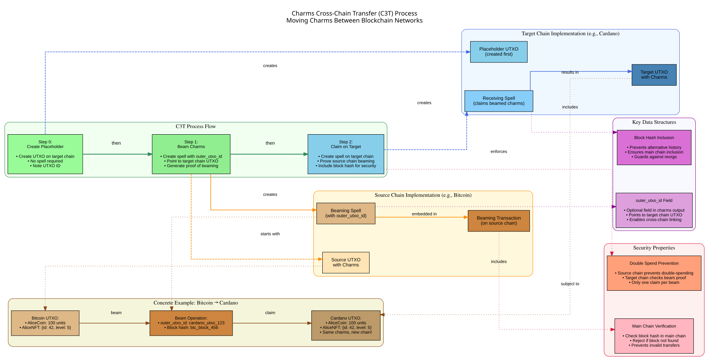

# Charms Architecture

This document provides an overview of the Charms architecture, explaining how the different components work together to enable programmable tokens and NFTs on Bitcoin.

## System Overview

The Charms system consists of several key components that work together to enable programmable assets on Bitcoin:

1. **Charms SDK**: Provides the framework for developing apps
2. **Charms Client**: Handles interaction with the Bitcoin blockchain
3. **Charms Data**: Defines the data structures used in the system
4. **Charms Spell Checker**: Verifies the correctness of spells
5. **SP1 zkVM**: Executes RISC-V programs and generates zero-knowledge proofs


*Figure 1: How the recursive proof system enables efficient verification*

## Component Architecture

### 1. Charms SDK

The Charms SDK (`charms-sdk`) provides the framework for developing apps. It includes:

- A macro system for defining app entrypoints using `charms_sdk::main!`
- Integration with the SP1 zkVM for proof generation
- Utilities for handling data serialization and deserialization
- Type-safe interfaces for app development

The SDK allows developers to write apps in Rust that compile to RISC-V binaries for execution in the SP1 zkVM.

### 2. App Contract Execution

Apps are the core programmable logic in Charms. They define how assets can be created, transferred, and transformed.


*Figure 2: How app contracts are executed in the SP1 zkVM*

#### App Contract Signature

All Charms apps implement the same fundamental signature:

```rust
fn app_contract(app: &App, tx: &Transaction, x: &Data, w: &Data) -> bool
```

Where:
- `app`: The app definition (tag, identity, verification key)
- `tx`: The complete transaction context
- `x`: Public input data (on-chain)
- `w`: Private input data (off-chain witness)

#### Special Cases

The system optimizes for common operations:
- **Token transfers** (tag='t'): Simple balance validation without full zkVM execution
- **NFT transfers** (tag='n'): Ownership transfer validation without proof generation
- **Custom apps**: Full zkVM execution with proof generation for arbitrary logic

### 3. Charms Client

The Charms Client (`charms-client`) handles interaction with the Bitcoin blockchain:

- **Spell Extraction**: Parses spells from Bitcoin transaction Taproot witnesses
- **Proof Verification**: Verifies Groth16 proofs using the appropriate verification keys
- **UTXO Management**: Tracks and manages UTXOs containing charms
- **Cross-Chain Support**: Handles C3T protocol operations

### 4. Data Structures

The core data structures enable the flexible composition of programmable assets:

#### App Structure
```rust
pub struct App {
    pub tag: char,        // 't' for tokens, 'n' for NFTs, or custom
    pub identity: B32,    // Unique identifier for the asset
    pub vk: B32,         // Verification key hash
}
```

#### Charms Structure
```rust
pub type Charms = BTreeMap<App, Data>;
```

This map structure allows multiple apps and their associated data to coexist in a single UTXO, enabling powerful composability patterns.

## Transaction Structure and Spell Processing

Charms extends Bitcoin's UTXO model without requiring any changes to the Bitcoin protocol itself.

### Spell Embedding

Spells are embedded in Bitcoin transactions using Taproot witnesses:

```
OP_FALSE
OP_IF
  OP_PUSH "spell"
  OP_PUSH $spell_data
  OP_PUSH $proof_data
OP_ENDIF
```

This creates a no-op script that doesn't affect Bitcoin's execution but carries the spell data.

### Normalization Process

Spells are normalized for efficient processing:

1. **App Indexing**: Apps are assigned integer indices to reduce data size
2. **Input Inheritance**: Transaction inputs are inherited from the Bitcoin transaction
3. **Output Optimization**: Only necessary output data is included

## Proof System Architecture

The recursive proof system is one of Charms' key innovations, enabling efficient verification without traversing the entire transaction history.

### Proof Generation Pipeline

The SP1 zkVM generates proofs through a multi-stage process:

1. **Core Proof**: Initial RISC-V execution trace
2. **Compression**: Reduce proof size for efficiency
3. **Shrinking**: Further optimization for minimal bandwidth
4. **Wrapping**: Convert to BN254 elliptic curve format
5. **Groth16 Conversion**: Final compact proof format

### Recursive Verification

Each spell proof attests to three critical properties:

1. **Well-Formed Spell**: The spell structure is valid and properly formatted
2. **App Contract Satisfaction**: All referenced app contracts return `true`
3. **Prerequisite Validity**: All input UTXOs have valid spell proofs

This recursive structure means verifying a single Groth16 proof is sufficient to validate the entire chain of custody for any charm.

## Cross-Chain Architecture

Charms supports cross-chain transfers through the C3T (Charms Cross-Chain Transfer) protocol.


*Figure 3: Complete C3T protocol for cross-chain asset movement*

### Key Design Principles

1. **Chain Agnostic Apps**: The same app contracts work on any supported blockchain
2. **Placeholder UTXOs**: Target chain UTXOs are created before beaming
3. **Block Hash Security**: Include source chain block hashes to prevent alternative history attacks
4. **Atomic Claims**: Assets can only be claimed once on the target chain

### Data Structure Extensions

The C3T protocol adds one optional field to the standard charm output structure:

```rust
pub struct NormalizedCharmsOutput {
    pub charms: NormalizedCharms,
    pub outer_utxo_id: Option<UtxoId>,  // Points to target chain UTXO
}
```

## Security Model

The Charms security model combines Bitcoin's proven security with zero-knowledge cryptography:

### Bitcoin Layer Security
- **Double-Spend Prevention**: Leverages Bitcoin's consensus mechanism
- **Transaction Finality**: Inherits Bitcoin's settlement guarantees
- **Decentralization**: No additional trust assumptions beyond Bitcoin nodes

### Cryptographic Security
- **Proof Integrity**: Groth16 proofs ensure computational integrity
- **App Isolation**: Apps cannot interfere with each other's logic
- **Recursive Verification**: Eliminates need for trusted indexers or validators

### Cross-Chain Security
- **Block Hash Verification**: Prevents alternative history attacks
- **Proof Aggregation**: Recursive proofs scale to arbitrary transaction depths
- **No Bridge Trust**: C3T requires no additional trusted parties

## Performance Characteristics

### Client-Side Verification
- **O(1) Verification**: Constant time regardless of transaction history depth
- **Minimal Bandwidth**: Only spell and proof data required
- **Web/Mobile Friendly**: Efficient enough for browser and mobile applications

### Proof Generation
- **Parallel Processing**: Multiple app proofs can be generated concurrently
- **Incremental Updates**: Only changed apps need new proofs
- **Hardware Acceleration**: Supports GPU acceleration for proof generation

## Developer Experience

The architecture prioritizes developer experience and familiar patterns:

### Standard Languages
- **Rust**: Primary development language with full tooling support
- **Future ISA**: Planned expansion of instruction set support to enable more languages
- **No Domain-Specific Language**: Use existing skills and tooling

### Familiar Patterns
- **Function Signatures**: Simple boolean return values for app contracts
- **Error Handling**: Standard Rust error handling patterns
- **Testing**: Built-in testing framework for app development

The next document explores spells and apps in detail, showing how developers can build applications using this architecture.
