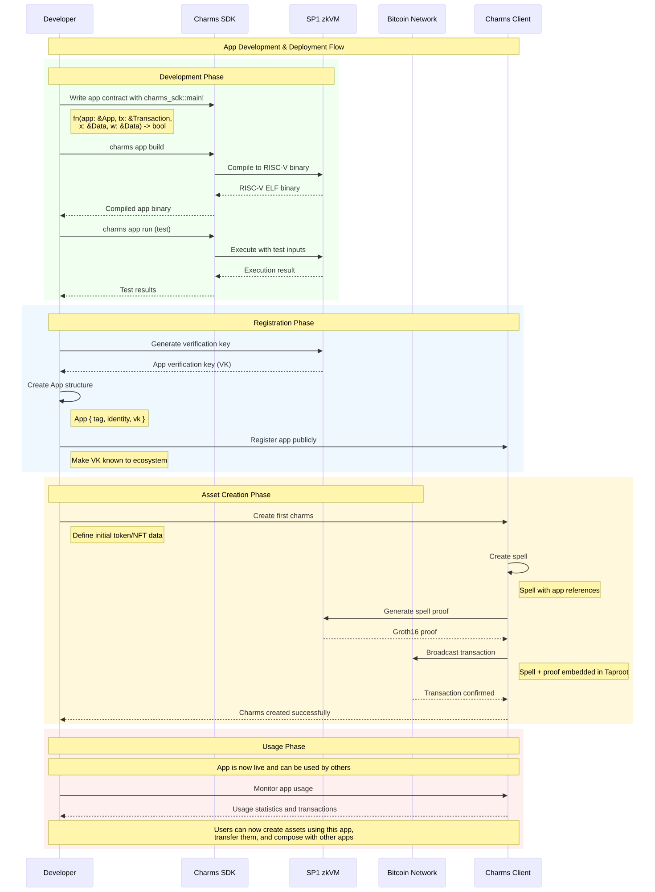

# Spells and Apps in Charms

This document explores the concepts of spells and apps in the Charms protocol, showing how they work together to enable programmable tokens and NFTs on Bitcoin.

## Understanding Spells

### What is a Spell?

A spell is a special message embedded in a Bitcoin transaction that creates or transforms Charms. Think of spells as the "instructions" that tell the Charms protocol what operations to perform on programmable assets.

### Spell Structure

A spell consists of several key components:

1. **Version**: The version of the Charms protocol
2. **Apps**: The applications referenced by the spell
3. **Public Inputs**: Public inputs to the apps (visible on-chain)
4. **Private Inputs**: Private inputs to the apps (kept off-chain as witness data)
5. **Inputs**: UTXOs being spent
6. **References**: UTXOs being referenced but not spent
7. **Outputs**: New UTXOs being created

Here's the core spell structure from the codebase:

```rust
pub struct Spell {
    /// Version of the protocol.
    pub version: u32,

    /// Apps used in the spell. Map of `$KEY: App`.
    /// Keys are arbitrary strings. They just need to be unique (inside the spell).
    pub apps: BTreeMap<String, App>,

    /// Public inputs to the apps for this spell. Map of `$KEY: Data`.
    #[serde(skip_serializing_if = "Option::is_none")]
    pub public_inputs: Option<BTreeMap<String, Data>>,

    /// Private inputs to the apps for this spell. Map of `$KEY: Data`.
    #[serde(skip_serializing_if = "Option::is_none")]
    pub private_inputs: Option<BTreeMap<String, Data>>,

    /// Transaction inputs.
    pub ins: Vec<Input>,
    /// Reference inputs.
    #[serde(skip_serializing_if = "Option::is_none")]
    pub refs: Option<Vec<Input>>,
    /// Transaction outputs.
    pub outs: Vec<Output>,
}
```

### Normalized Spells

For processing and verification, spells are normalized into a standardized format called `NormalizedSpell`. This format:

- Uses indices instead of string keys for apps to reduce size
- Ensures consistent ordering of inputs and outputs
- Separates public and private inputs for efficient proof generation

The normalization process is handled by the `normalized` method in the `Spell` struct.

### Spell Verification

Spells are verified using the Charms Spell Checker, which ensures:

1. **Well-Formed Structure**: The spell is properly formatted and valid
2. **App Contract Satisfaction**: All referenced app contracts return `true`
3. **Input/Output Validity**: The spell's inputs and outputs are legitimate

The verification process leverages the recursive proof system to validate the entire transaction history efficiently.

## Understanding Apps

### What is an App?

An app is a program that defines the rules for creating and transforming Charms. Apps specify how tokens, NFTs, or arbitrary application state can be created, transferred, or modified.

### App Structure

An app consists of three key components:

```rust
pub struct App {
    pub tag: char,        // Single character identifier
    pub identity: B32,    // 32-byte unique identifier  
    pub vk: B32,         // 32-byte verification key hash
}
```

1. **Tag**: A single character identifier (e.g., 't' for tokens, 'n' for NFTs)
2. **Identity**: A 32-byte hash that uniquely identifies the app among others with the same tag
3. **Verification Key**: A 32-byte hash used to verify proofs generated by the app

### Special App Tags

The Charms protocol defines two special app tags for optimization:

1. **TOKEN ('t')**: For fungible tokens with simple transfer validation
2. **NFT ('n')**: For non-fungible tokens with ownership verification

These special tags allow for simplified handling of common use cases without requiring full zkVM execution.

### App Development Process

The development process for Charms apps follows a clear workflow:


*Figure 1: Complete app development and deployment workflow*

#### 1. Development Phase

Apps are developed using the Charms SDK, which provides:

- **Entrypoint Macro**: The `charms_sdk::main!` macro for defining app logic
- **Type Safety**: Rust's type system ensures correctness at compile time
- **Testing Framework**: Built-in tools for testing app behavior

Here's an example of how an app entrypoint is defined:

```rust
charms_sdk::main! {
    |app: &App, tx: &Transaction, x: &Data, w: &Data| -> bool {
        // App logic here
        // Return true if the transaction is valid, false otherwise
        true
    }
}
```

#### 2. Compilation and Deployment

Apps are compiled to RISC-V binaries that can be executed in the SP1 zkVM:

1. **Rust Compilation**: `cargo build` compiles the Rust code
2. **RISC-V Target**: Code is compiled for the RISC-V architecture
3. **Verification Key Generation**: The compiled binary generates a unique verification key
4. **App Registration**: The app and its verification key are made publicly known

### App Execution Flow

When a spell references an app, the execution follows a specific process:


*Figure 2: How app contracts are executed and validated*

#### Execution Context

Apps receive four parameters during execution:

1. **App (`&App`)**: The app definition itself
2. **Transaction (`&Transaction`)**: The complete transaction context
3. **Public Input (`&Data`)**: App-specific on-chain data
4. **Private Input (`&Data`)**: App-specific off-chain witness data

#### Validation Rules

App contracts enforce various types of rules:

- **Conservation Rules**: Ensure token amounts are preserved or properly modified
- **Authorization Rules**: Verify signatures and spending permissions
- **State Transition Rules**: Validate business logic and state changes
- **Composability Constraints**: Ensure apps work together correctly

## Interaction Between Spells and Apps

Spells and apps work together through a well-defined interaction model:

### 1. Reference Relationship

Spells reference apps by including them in the `apps` field. This creates a binding between the spell and the app's logic.

### 2. Input Provision

Spells provide inputs to apps through:
- **Public Inputs**: Data that will be visible on-chain
- **Private Inputs**: Witness data kept off-chain for privacy

### 3. Execution and Verification

When a spell is processed:
1. Referenced apps are executed with the provided inputs
2. Each app returns a boolean indicating transaction validity
3. Zero-knowledge proofs are generated to attest to correct execution
4. The spell is embedded in a Bitcoin transaction with its proof

### 4. Composability

Multiple apps can be referenced in a single spell, enabling powerful composability patterns:

- **Token + NFT**: An NFT that manages a token's supply
- **DEX + Token**: A decentralized exchange order referencing specific tokens
- **Game + Asset**: Gaming logic combined with asset management

## Practical Examples

### Example 1: Simple Token Transfer

For a basic token transfer between Alice and Bob:

```rust
// Simplified token app logic
charms_sdk::main! {
    |app: &App, tx: &Transaction, x: &Data, w: &Data| -> bool {
        // Verify total input tokens = total output tokens
        let input_total = calculate_input_total(tx, app);
        let output_total = calculate_output_total(tx, app);
        input_total == output_total
    }
}
```

This app ensures conservation of tokens across the transaction.

### Example 2: NFT with State Updates

For an NFT that can level up in a game:

```rust
charms_sdk::main! {
    |app: &App, tx: &Transaction, x: &Data, w: &Data| -> bool {
        let old_state: GameNFT = x.deserialize()?;
        let new_state: GameNFT = w.deserialize()?;
        
        // Verify valid level progression
        new_state.level == old_state.level + 1 &&
        new_state.experience >= experience_required(new_state.level)
    }
}
```

This app validates that NFT state changes follow game rules.

### Example 3: Cross-Chain Asset Movement

For moving assets between chains using C3T:

```rust
charms_sdk::main! {
    |app: &App, tx: &Transaction, x: &Data, w: &Data| -> bool {
        // For beaming: verify outer_utxo_id is set correctly
        // For claiming: verify source chain proof is valid
        match operation_type(x) {
            OperationType::Beam => verify_beam_operation(tx, x),
            OperationType::Claim => verify_claim_operation(tx, x, w),
        }
    }
}
```

This enables the same app logic to work across different blockchains.

## Advanced Concepts

### Composability Patterns

Charms enables several powerful composability patterns:

1. **Asset Bundling**: Multiple assets in a single UTXO
2. **Cross-App Dependencies**: Apps that reference other apps' state
3. **Conditional Logic**: Apps that implement complex conditional behavior
4. **Upgradeable Logic**: Apps that can evolve over time

### Error Handling

Apps should handle errors gracefully:

- **Return `false`**: For invalid transactions that should be rejected
- **Panic Prevention**: Avoid panics that could break proof generation
- **Clear Logic**: Make validation logic explicit and auditable

### Testing and Debugging

The Charms SDK provides tools for testing apps:

- **Unit Tests**: Test individual app functions
- **Integration Tests**: Test apps within complete spell contexts
- **Simulation**: Run apps against hypothetical transactions

## Best Practices

### App Development

1. **Keep Logic Simple**: Complex logic is harder to audit and debug
2. **Handle Edge Cases**: Consider all possible input scenarios
3. **Use Type Safety**: Leverage Rust's type system for correctness
4. **Document Behavior**: Clear documentation helps users understand app rules

### Spell Creation

1. **Minimize Complexity**: Simpler spells are easier to verify and debug
2. **Batch Operations**: Group related operations in single spells when possible
3. **Test Thoroughly**: Verify spells work as expected before deployment
4. **Consider Gas Costs**: More complex spells require more computation

The next document explores the zero-knowledge proof system that makes this programmability secure and efficient.
