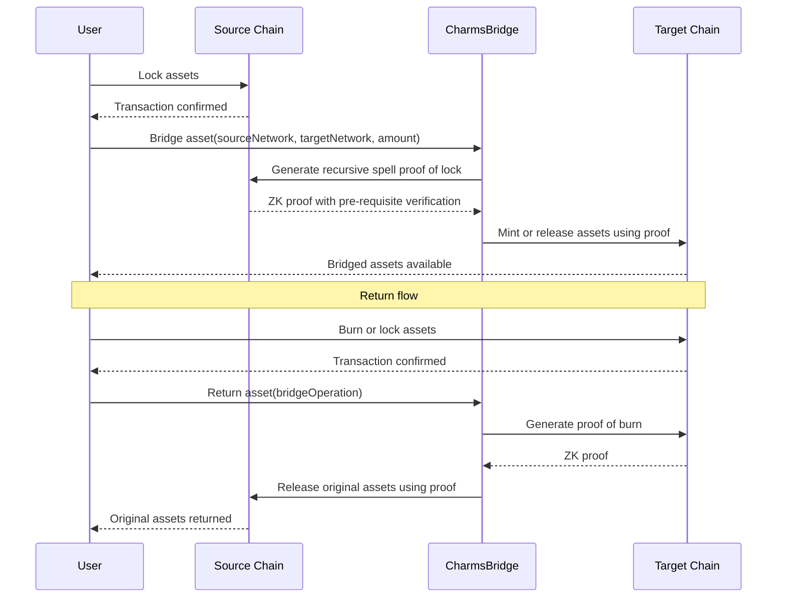

# Cross-Chain State Channels Feasibility

This document explores the feasibility of implementing cross-chain state channels using the Charms protocol, focusing on the technical challenges and potential solutions.

## 1. Abstract Cell Model

The key insight for enabling cross-chain compatibility is to map all chain-specific state containers to an abstract "Cell" concept:

```rust
/// An abstract cell
struct AbstractCell {
    /// The cell ID
    id: CellId,
    /// The amount of value in the cell
    amount: Amount,
    /// The lock condition for the cell
    lock_condition: LockCondition,
    /// Application-specific data
    app_data: Data,
}

/// Methods for interacting with an abstract cell
trait CellOperations {
    /// Unlock the cell
    fn unlock(&self, proof: UnlockProof) -> Result<(), Error>;
    
    /// Verify the cell's state
    fn verify(&self, verification_data: VerificationData) -> Result<(), Error>;
}
```

This abstract cell model can be implemented for different blockchain architectures:

### 1.1 Bitcoin (UTXO Model)

```rust
/// A Bitcoin UTXO implementation of an abstract cell
struct BitcoinUTXO {
    /// The UTXO ID (txid:vout)
    id: UtxoId,
    /// The amount of value in the UTXO
    amount: Amount,
    /// The lock script (scriptPubKey)
    lock_script: ScriptBuf,
    /// Application-specific data (in OP_RETURN)
    metadata: Vec<u8>,
}

impl CellOperations for BitcoinUTXO {
    fn unlock(&self, proof: UnlockProof) -> Result<(), Error> {
        // Unlock the UTXO using the proof
        // This would create a transaction spending the UTXO
        unimplemented!()
    }
    
    fn verify(&self, verification_data: VerificationData) -> Result<(), Error> {
        // Verify the UTXO's state
        // This would check that the UTXO exists and has the expected properties
        unimplemented!()
    }
}
```

### 1.2 Ethereum (Account Model)

```rust
/// An Ethereum storage implementation of an abstract cell
struct EVMStorage {
    /// The storage identifier (contract:slot)
    id: StorageId,
    /// The amount of value
    amount: Amount,
    /// The function selector
    function_selector: [u8; 4],
    /// Application-specific data (in contract storage)
    storage: Vec<u8>,
}

impl CellOperations for EVMStorage {
    fn unlock(&self, proof: UnlockProof) -> Result<(), Error> {
        // Unlock the storage using the proof
        // This would call a function on the contract
        unimplemented!()
    }
    
    fn verify(&self, verification_data: VerificationData) -> Result<(), Error> {
        // Verify the storage's state
        // This would check that the storage has the expected properties
        unimplemented!()
    }
}
```

### 1.3 Cardano (eUTXO Model)

```rust
/// A Cardano eUTXO implementation of an abstract cell
struct CardanoEUTXO {
    /// The eUTXO ID (txid:index)
    id: EUtxoId,
    /// The amount of value
    amount: Amount,
    /// The validator script
    validator: Script,
    /// Application-specific data (in datum)
    datum: Data,
}

impl CellOperations for CardanoEUTXO {
    fn unlock(&self, proof: UnlockProof) -> Result<(), Error> {
        // Unlock the eUTXO using the proof
        // This would create a transaction spending the eUTXO
        unimplemented!()
    }
    
    fn verify(&self, verification_data: VerificationData) -> Result<(), Error> {
        // Verify the eUTXO's state
        // This would check that the eUTXO exists and has the expected properties
        unimplemented!()
    }
}
```

## 2. Generic Architecture for Cross-Chain Compatibility

To enable cross-chain compatibility, we need a generic architecture that abstracts away the details of specific blockchains:

```rust
/// A network connector
trait NetworkConnector {
    /// Broadcast a transaction
    fn broadcast(&self, transaction: Transaction) -> Result<TransactionId, Error>;
    
    /// Get the status of a transaction
    fn get_status(&self, transaction_id: TransactionId) -> Result<TransactionStatus, Error>;
    
    /// Get a proof of a transaction
    fn get_proof(&self, transaction_id: TransactionId) -> Result<TransactionProof, Error>;
}

/// An asset handler
trait AssetHandler {
    /// Lock an asset
    fn lock(&self, amount: Amount, lock_condition: LockCondition) -> Result<CellId, Error>;
    
    /// Unlock an asset
    fn unlock(&self, cell_id: CellId, unlock_proof: UnlockProof) -> Result<(), Error>;
    
    /// Verify an asset
    fn verify(&self, cell_id: CellId, verification_data: VerificationData) -> Result<(), Error>;
}

/// An instruction executor
trait InstructionExecutor {
    /// Execute an instruction
    fn execute(&self, instruction: Instruction, context: Context) -> Result<ExecutionResult, Error>;
    
    /// Verify an instruction
    fn verify(&self, instruction: Instruction, expected_result: ExecutionResult, context: Context) -> Result<(), Error>;
}

/// A proof system
trait ProofSystem {
    /// Generate a proof
    fn generate(&self, statement: Statement, witness: Witness) -> Result<Proof, Error>;
    
    /// Verify a proof
    fn verify(&self, statement: Statement, proof: Proof) -> Result<(), Error>;
}
```

These interfaces can be implemented for different blockchain environments:

### 2.1 Bitcoin Implementation

```rust
/// A Bitcoin network connector
struct BitcoinNetworkConnector {
    /// The Bitcoin RPC client
    client: BitcoinRpcClient,
}

impl NetworkConnector for BitcoinNetworkConnector {
    // Implementation details...
}

/// A Bitcoin asset handler
struct BitcoinAssetHandler {
    /// The Bitcoin network connector
    connector: BitcoinNetworkConnector,
}

impl AssetHandler for BitcoinAssetHandler {
    // Implementation details...
}

/// A Bitcoin instruction executor
struct BitcoinInstructionExecutor {
    /// The Bitcoin network connector
    connector: BitcoinNetworkConnector,
}

impl InstructionExecutor for BitcoinInstructionExecutor {
    // Implementation details...
}

/// A Bitcoin proof system
struct BitcoinProofSystem {
    /// The Bitcoin network connector
    connector: BitcoinNetworkConnector,
}

impl ProofSystem for BitcoinProofSystem {
    // Implementation details...
}
```

### 2.2 Ethereum Implementation

```rust
/// An Ethereum network connector
struct EthereumNetworkConnector {
    /// The Ethereum RPC client
    client: EthereumRpcClient,
}

impl NetworkConnector for EthereumNetworkConnector {
    // Implementation details...
}

/// An Ethereum asset handler
struct EthereumAssetHandler {
    /// The Ethereum network connector
    connector: EthereumNetworkConnector,
}

impl AssetHandler for EthereumAssetHandler {
    // Implementation details...
}

/// An Ethereum instruction executor
struct EthereumInstructionExecutor {
    /// The Ethereum network connector
    connector: EthereumNetworkConnector,
}

impl InstructionExecutor for EthereumInstructionExecutor {
    // Implementation details...
}

/// An Ethereum proof system
struct EthereumProofSystem {
    /// The Ethereum network connector
    connector: EthereumNetworkConnector,
}

impl ProofSystem for EthereumProofSystem {
    // Implementation details...
}
```

## 3. Cross-Chain Protocol

With these abstractions in place, we can define a cross-chain protocol that enables token bridging and smart protocol execution:

```rust
/// A cross-chain protocol
struct CrossChainProtocol {
    /// The network connectors for different chains
    network_connectors: HashMap<ChainId, Box<dyn NetworkConnector>>,
    /// The asset handlers for different chains
    asset_handlers: HashMap<ChainId, Box<dyn AssetHandler>>,
    /// The instruction executors for different chains
    instruction_executors: HashMap<ChainId, Box<dyn InstructionExecutor>>,
    /// The proof systems for different chains
    proof_systems: HashMap<ChainId, Box<dyn ProofSystem>>,
}

impl CrossChainProtocol {
    /// Bridge an asset from one chain to another
    fn bridge_asset(
        &self,
        source_chain: ChainId,
        target_chain: ChainId,
        amount: Amount,
    ) -> Result<BridgeOperation, Error> {
        // Get the asset handlers for the source and target chains
        let source_handler = self.asset_handlers.get(&source_chain).ok_or(Error::UnknownChain)?;
        let target_handler = self.asset_handlers.get(&target_chain).ok_or(Error::UnknownChain)?;
        
        // Lock the asset on the source chain
        let lock_condition = LockCondition::CrossChainTransfer {
            target_chain,
            recipient: self.get_bridge_address(target_chain),
        };
        let cell_id = source_handler.lock(amount, lock_condition)?;
        
        // Generate a proof of the lock
        let source_proof_system = self.proof_systems.get(&source_chain).ok_or(Error::UnknownChain)?;
        let statement = Statement::AssetLocked {
            chain_id: source_chain,
            cell_id,
            amount,
            lock_condition,
        };
        let witness = self.get_lock_witness(source_chain, cell_id)?;
        let proof = source_proof_system.generate(statement, witness)?;
        
        // Mint or release the asset on the target chain
        let unlock_proof = UnlockProof::CrossChainTransfer {
            source_chain,
            proof,
        };
        target_handler.unlock(self.get_bridge_cell_id(target_chain), unlock_proof)?;
        
        Ok(BridgeOperation {
            source_chain,
            target_chain,
            amount,
            status: BridgeStatus::Completed,
        })
    }
    
    /// Execute a cross-chain protocol
    fn execute_protocol(
        &self,
        protocol: Protocol,
    ) -> Result<ProtocolExecution, Error> {
        // Execute the protocol across multiple chains
        let mut execution = ProtocolExecution {
            protocol: protocol.clone(),
            steps: Vec::new(),
            status: ProtocolStatus::InProgress,
        };
        
        for step in protocol.steps {
            let chain_id = step.chain_id;
            let instruction_executor = self.instruction_executors.get(&chain_id).ok_or(Error::UnknownChain)?;
            
            let result = instruction_executor.execute(step.instruction, step.context)?;
            
            execution.steps.push(ProtocolStep {
                chain_id,
                instruction: step.instruction,
                result,
                status: StepStatus::Completed,
            });
        }
        
        execution.status = ProtocolStatus::Completed;
        
        Ok(execution)
    }
    
    // Helper methods...
}
```

## 4. Charms Integration for Cross-Chain Operations

To integrate this cross-chain protocol with Charms, we need to define Charms apps that can handle cross-chain operations:

```rust
/// A Charms app for cross-chain operations
struct CrossChainApp {
    /// The cross-chain protocol
    protocol: CrossChainProtocol,
}

impl CrossChainApp {
    /// Bridge an asset from one chain to another
    fn bridge_asset(
        &self,
        app: &App,
        tx: &Transaction,
        x: &Data,
        w: &Data,
    ) -> bool {
        // Parse the public and private inputs
        let public_input: CrossChainPublicInput = x.value().unwrap();
        let private_input: CrossChainPrivateInput = w.value().unwrap();
        
        // Bridge the asset
        let result = self.protocol.bridge_asset(
            public_input.source_chain,
            public_input.target_chain,
            public_input.amount,
        );
        
        // Check if the operation was successful
        result.is_ok()
    }
    
    /// Execute a cross-chain protocol
    fn execute_protocol(
        &self,
        app: &App,
        tx: &Transaction,
        x: &Data,
        w: &Data,
    ) -> bool {
        // Parse the public and private inputs
        let public_input: ProtocolPublicInput = x.value().unwrap();
        let private_input: ProtocolPrivateInput = w.value().unwrap();
        
        // Execute the protocol
        let result = self.protocol.execute_protocol(
            private_input.protocol,
        );
        
        // Check if the execution was successful
        result.is_ok()
    }
}
```

## 5. Recursive Proof Verification

One of the key features of Charms is its recursive proving system, which allows for efficient verification of complex operations. This is particularly valuable for cross-chain operations, where we need to verify that operations on one chain are correctly reflected on another.

```rust
/// Generate a recursive proof of a cross-chain operation
fn generate_recursive_proof(
    operation: CrossChainOperation,
    previous_proofs: Vec<Proof>,
) -> Result<Proof, Error> {
    // Generate a recursive proof that attests to:
    // 1. The validity of the current operation
    // 2. The validity of all dependent operation proofs
    
    // This would use the SP1 zkVM to execute the verification logic
    // and generate a zero-knowledge proof
    
    unimplemented!()
}

/// Verify a recursive proof of a cross-chain operation
fn verify_recursive_proof(
    operation: CrossChainOperation,
    proof: Proof,
) -> Result<(), Error> {
    // Verify the recursive proof
    // This would use the Groth16 verifier to check the proof
    
    unimplemented!()
}
```

This recursive proving system eliminates the need to traverse the transaction graph to verify asset provenance, replacing it with a single proof verification.

## 6. EVM Implementation of Charms Schema

For Ethereum and other EVM-compatible chains, we can implement the Charms schema as follows:

```solidity
// Core Charms data structure for EVM
struct App {
    bytes1 tag;                // 't' for token, 'n' for NFT, etc.
    bytes32 identity;          // Asset identifier
    bytes32 vk;                // Verification key hash
}

struct CharmCell {
    address owner;             // Cell owner
    uint256 amount;            // Cell value
    bytes lockCondition;       // Lock condition
    mapping(bytes32 => bytes) charms;  // App => Data mapping
}

// Storage layout
contract CharmsProtocol {
    // Cell registry
    mapping(bytes32 => CharmCell) public cells;
    
    // App registry
    mapping(bytes32 => address) public appContracts;
    
    // Transaction registry
    mapping(bytes32 => bool) public processedTransactions;
    
    // Bridge an asset from another chain
    function bridgeAsset(
        uint256 sourceChain,
        bytes calldata proof
    ) external returns (bool) {
        // Verify the proof
        require(verifyProof(sourceChain, proof), "Invalid proof");
        
        // Extract the asset details from the proof
        (bytes32 assetId, uint256 amount, address recipient) = extractAssetDetails(proof);
        
        // Mint or release the asset
        mintOrRelease(assetId, amount, recipient);
        
        return true;
    }
    
    // Return an asset to another chain
    function returnAsset(
        uint256 targetChain,
        bytes32 assetId,
        uint256 amount
    ) external returns (bool) {
        // Burn or lock the asset
        burnOrLock(assetId, amount, msg.sender);
        
        // Generate a proof of the burn or lock
        bytes memory proof = generateProof(targetChain, assetId, amount, msg.sender);
        
        // Emit an event with the proof
        emit AssetReturned(targetChain, assetId, amount, msg.sender, proof);
        
        return true;
    }
    
    // Verify a spell proof
    function verifySpell(
        bytes calldata spellData,
        bytes calldata proof
    ) external view returns (bool) {
        // Decode the spell
        NormalizedSpell memory spell = decodeSpell(spellData);
        
        // Verify the spell with the recursive proof
        return verifySpellProof(spell, proof);
    }
    
    // Helper functions...
}
```

## 7. Mapping of Lock Conditions

Different blockchain environments have different ways of implementing lock conditions:

| Concept | Bitcoin | EVM | Cardano |
|---------|---------|-----|---------|
| Multi-sig | P2SH/P2WSH script | Contract with ecrecover | Multi-signature validator |
| Timelock | OP_CHECKLOCKTIMEVERIFY | block.timestamp check | timelock validator |
| ZK-Proof | BitSNARK verification | ZK verifier contract | ZK validator |
| App execution | BitSNARK VM | EVM execution | Plutus execution |

## 8. Cross-Chain Bridging Flow

The following sequence diagram illustrates the flow of a cross-chain asset bridge using Charms:



## 9. Example: Cross-Chain DEX

To illustrate the power of cross-chain state channels in Charms, let's consider a decentralized exchange that operates across multiple blockchains:

```rust
/// Cross-chain DEX state
struct CrossChainDEXState {
    /// The order books for different trading pairs
    order_books: HashMap<TradingPair, OrderBook>,
    /// The balances of users on different chains
    balances: HashMap<(ChainId, UserId), HashMap<TokenId, Amount>>,
    /// The liquidity pools on different chains
    liquidity_pools: HashMap<ChainId, HashMap<TradingPair, LiquidityPool>>,
}

/// Cross-chain DEX transaction
enum CrossChainDEXTx {
    /// Place an order
    PlaceOrder {
        /// The chain ID
        chain_id: ChainId,
        /// The order
        order: Order,
    },
    /// Cancel an order
    CancelOrder {
        /// The chain ID
        chain_id: ChainId,
        /// The order ID
        order_id: OrderId,
    },
    /// Execute a trade
    ExecuteTrade {
        /// The source chain ID
        source_chain_id: ChainId,
        /// The target chain ID
        target_chain_id: ChainId,
        /// The trade
        trade: Trade,
    },
    /// Deposit funds
    Deposit {
        /// The chain ID
        chain_id: ChainId,
        /// The user ID
        user_id: UserId,
        /// The token ID
        token_id: TokenId,
        /// The amount
        amount: Amount,
    },
    /// Withdraw funds
    Withdraw {
        /// The chain ID
        chain_id: ChainId,
        /// The user ID
        user_id: UserId,
        /// The token ID
        token_id: TokenId,
        /// The amount
        amount: Amount,
    },
}
```

This cross-chain DEX would allow users to:

1. Place orders on any supported blockchain
2. Execute trades across different blockchains
3. Deposit and withdraw funds on any supported blockchain

The state channel framework would enable these operations to be performed off-chain, with on-chain settlement only when necessary.

## 10. Technical Challenges and Solutions

### 10.1 Atomic Cross-Chain Operations

One of the key challenges in cross-chain operations is ensuring atomicity - either all operations succeed or all fail. This is particularly challenging when dealing with multiple blockchains with different consensus mechanisms and finality guarantees.

**Solution**: Use a two-phase commit protocol with timeouts and recovery mechanisms. The protocol would work as follows:

1. **Prepare Phase**: Lock assets on all chains and generate proofs of the locks
2. **Commit Phase**: Use the proofs to unlock assets on the target chains
3. **Timeout and Recovery**: If any operation fails, use timeouts and recovery mechanisms to ensure that assets are not lost

### 10.2 Cross-Chain Consensus

Another challenge is achieving consensus across multiple chains, especially when they have different consensus mechanisms and security models.

**Solution**: Use a federated consensus model with threshold signatures. The model would work as follows:

1. **Federated Validators**: A set of validators that monitor multiple chains
2. **Threshold Signatures**: Require a threshold of validators to sign off on cross-chain operations
3. **Economic Incentives**: Provide economic incentives for validators to behave honestly

### 10.3 Scalability

Cross-chain operations can be expensive and slow, especially when they involve multiple on-chain transactions.

**Solution**: Use state channels to perform most operations off-chain, with on-chain settlement only when necessary. The approach would work as follows:

1. **Off-Chain Operations**: Perform most operations off-chain using state channels
2. **Batched Settlement**: Settle multiple operations in a single on-chain transaction
3. **Recursive Proofs**: Use recursive proofs to verify complex operations efficiently

### 10.4 Security

Cross-chain operations introduce new security challenges, especially when dealing with chains with different security models.

**Solution**: Use a defense-in-depth approach with multiple security mechanisms. The approach would include:

1. **Formal Verification**: Formally verify the cross-chain protocol
2. **Economic Security**: Design economic incentives to ensure that attacks are unprofitable
3. **Monitoring and Recovery**: Implement monitoring and recovery mechanisms to detect and respond to attacks

## 11. Conclusion

Cross-chain state channels using Charms are feasible, but they require careful design and implementation to address the technical challenges. The key advantages of this approach include:

1. **Unified Model**: A single programming model that works across different blockchain architectures
2. **Efficient Verification**: Recursive proofs that eliminate the need for transaction graph traversal
3. **Composability**: The ability to compose cross-chain operations into complex protocols
4. **Scalability**: Off-chain computation with on-chain settlement for improved scalability

By leveraging the abstractions provided by the abstract cell model, generic architecture, and recursive proving system, we can enable seamless token bridging and cross-chain smart protocol execution.
